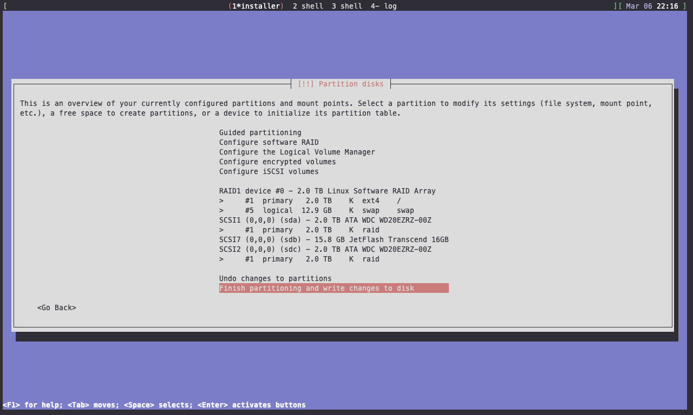

# Dokumentation der Docker Engine der UnixAG Zweibrücken - Projektname: Portal

## Einrichtung des Basissystems

Diese Dokumentation geht von einer akutellen Debian-Installation mit Minimalkonfiguration aus.

### RAID



- 2 Partitionen (eine je Festplatte) in identischer Größe mit `msdos` Partitionsschema anlegen und für die Verwendung im RAID vormerken.
- RAID 1 mit beiden Partitionen anlegen.
- Guided Partitioning verwenden, um die root-Partition unter `/` und den Swap automatisch auf dem RAID anzulegen.

### Automatische Updates

Zuerst holen wir uns die neuesten Paketquellen.
```bash
sudo apt update
```
Um Updates automatisch zu beziehen, verwenden wir `cron-apt`.

```bash
sudo apt install cron-apt
```

Die Standardkonfiguration von `cron-apt` lädt die Updates nur herunter, installiert sie aber nicht automatisch. Das ändern wir, indem wir die folgenden beiden Dateien entsprechend anpassen.

1. `/etc/cron-apt/action.d/0-update`
```bash
sudo bash -c 'echo "update -o quiet=2" > /etc/cron-apt/action.d/0-update'
```
2. `/etc/cron-apt/action.d/3-download`
```bash
sudo bash -c 'printf "autoclean -y\ndist-upgrade -y -o APT::Get::Show-Upgraded=true" > /etc/cron-apt/action.d/3-download'
```

Mit dieser Konfiguration sind auch Distupgrades automatisiert.

### Mehr Sicherheit!
Wir installieren Tools, um mit `apt` auch über HTTPS Pakete laden zu können.

```bash
sudo apt install \
     apt-transport-https \
     ca-certificates \
     curl \
     gnupg2 \
     software-properties-common
```

Dann müssen die Paketquellen angepasst werden. Hierzu wird `/etc/apt/sources.list` bearbeitet:
```bash
sudo bash -c 'sed "s/http:/https:/" -i /etc/apt/sources.list'
```

Zudem müssen die folgenden Zeilen auskommentiert werden - `security.debian.org` unterstützt HTTPS nicht.
```
deb https://security.debian.org/debian-security stretch/updates main contrib non-free
deb-src https://security.debian.org/debian-security stretch/updates main contrib non-free
```

Um das System vor unbefugtem Zugriff zu schützen, empfiehlt es sich, `fail2ban` zu installieren.

```bash
sudo apt install fail2ban
```

Falls die Konfiguration angepasst werden soll (Fehlversuche beim Login bis zum Block, Block-Dauer etc), dann muss dies in `/etc/fail2ban/jail.local` erfolgen. Als Basis dafür kann man die Standardkonfiguration /etc`/fail2ban/jail.conf` nutzen.

```bash
sudo cp /etc/fail2ban/jail.conf /etc/fail2ban/jail.local
```

### Nützliche Software installieren
```
sudo apt install curl wget vim zsh fish htop iftop iotop grc git jq pv tree
curl -LO https://github.com/BurntSushi/ripgrep/releases/download/0.10.0/ripgrep_0.10.0_amd64.deb
sudo dpkg -i ripgrep_0.10.0_amd64.deb
curl -LO https://github.com/sharkdp/fd/releases/download/v7.3.0/fd_7.3.0_amd64.deb
sudo dpkg -i fd_7.3.0_amd64.deb
```

### Docker installieren

Wir laden den GPG Key und überprüfen den Fingerprint. Der Fingerprint sollte auf `9DC8 5822 9FC7 DD38 854A E2D8 8D81 803C 0EBF CD88` lauten, falls sich der Fingerprint ändert, kann er unter der [https://docs.docker.com/install/linux/docker-ce/debian/#set-up-the-repository](Docker Installationsanleitung) nachgeschlagen werden.

```bash
curl -fsSL https://download.docker.com/linux/debian/gpg | sudo apt-key add -curl -fsSL https://download.docker.com/linux/debian/gpg | sudo apt-key add -
sudo apt-key fingerprint 0EBFCD88
```

Das Repo mit der Docker Community Edition (Docker CE) hinzufügen

```bash
sudo add-apt-repository \
   "deb [arch=amd64] https://download.docker.com/linux/debian \
   $(lsb_release -cs) \
   stable"
```

Noch einmal die neuen Paketquellen laden und dann Docker installieren.

```bash
sudo apt update
sudo apt install docker-ce
```

Abschließend verifizieren wir die Installation mit folgendem Kommando:

```bash
sudo docker run hello-world
```

### Docker-Compose installieren

Diese Komponente ist optional, aber bei Bedarf leicht mittels folgender Kommandos installierbar.

```bash
sudo curl -L https://github.com/docker/compose/releases/download/1.22.0/docker-compose-$(uname -s)-$(uname -m) -o /usr/local/bin/docker-compose
sudo chmod +x /usr/local/bin/docker-compose
```

## Der Aufbau unserer Docker Engine

Die UnixAG organisiert Dienste auf Portal mit Stacks. Deren Konfiguration wird unter `/etc/stacks/` in einem eigenen Ordern für jeden Dienst gespeichert.

```bash
mkdir /etc/stacks
```

Ein Ordner unter `/etc/stacks/`, wie zB `/etc/stacks/gitlab/` für die GitLab-Instanz der UnixAG, beinhalten mindestens eine `deploy.sh` Datei, die als kurzes Skript den Dienst, der im jeweiligen Ordner konfiguriert ist, ausrollt, und eine `docker-compose.yml`, die die notwendigen Container und deren Konfiguration beschreiben.

```bash
$ tree /etc/stacks/gitlab/
/etc/stacks/gitlab/
├── deploy.sh
└── docker-compose.yml

0 directories, 2 files
```

Die docker-compose.yml wird nachfolgend aufgestückelt und erklärt.
### Eine typische docker-compose.yml

```yaml
version: "3.6"
services:
  gitlab:
    image: gitlab/gitlab-ce:latest
    volumes:
      - /srv/gitlab/config:/etc/gitlab
      - /srv/gitlab/logs:/var/log/gitlab
      - /srv/gitlab/data:/var/opt/gitlab
    ports:
      - "9901:80"
      - "2222:22"
    deploy:
      restart_policy:
        condition: any
      resources:
        limits:
          memory: 4g
    environment:
      - VIRTUAL_HOST=portal.unixag.net
      - VIRTUAL_PORT=80
      - LETSENCRYPT_EMAIL=sprecher@unixag.net
      - LETSENCRYPT_HOST=portal.unixag.net
networks:
  default:
    external:
      name: nginx-proxy_default
```

Nachfolgend wird diese `docker-compose.yml` abschnittsweise erklärt.
```yaml
version: "3.6"
```
Die Version der Docker-Compose-/Docker-Stack-Spezikation. `3.6` ist für Herbst 2018 die aktuelle Spezifikation.

```yaml
services:
  gitlab:
    image: gitlab/gitlab-ce:latest
```
  Das Image wird mit dem Link auf das (hub.docker.com/)[Docker Hub] und der Verionsnummer angegeben. `latest` holt stets die neueste Version des Images.

```yaml
    volumes:
      - /srv/gitlab/config:/etc/gitlab
      - /srv/gitlab/logs:/var/log/gitlab
      - /srv/gitlab/data:/var/opt/gitlab
```
Hier stehen Dateien und Ordern, die vom Host auf den Container gemappt werden sollen. Sämtliche persistenten Daten müssen/sollten hier angegeben sein. Ansonsten werden die Daten bei Neuerstellung des Containers gelöscht. Die UnixAG verwendet hierfür den Ordner `/srv/`, in dem für jeden Dienst analog zum Ordner in `/etc/stacks/` ein Ordner für persistente Daten angelegt wird.

```yaml
    ports:
      - "9901:80"
      - "2222:22"
```
Dieser Abschnitt beschreibt, welche Ports vom Container nach außen durchgereicht werden sollen. Sämtliche Webdienste sollten HTTP verwenden (keinesfalls HTTPS! (Erklärung in späterem Abschnitt)) und nach außen auf Port 80 verfügbar sein. Der interne Port 80 ist zudem von außen über den Port 9901 und der Port 22 über 2222 erreichbar. Die Reihenfolge in der Portangabe hierzu lautet `HOST:CONTAINER`!

```yaml
    deploy:
      restart_policy:
        condition: any
```
Somit wird der Container bei Absturz stets neu hochgefahren, sehr empfehlenswerte Einstellung.

```yaml
      resources:
        limits:
          memory: 4g
```
Beschränkt den verfügbaren Arbeitsspeicher auf maximal 4GB. Man kann Mindestzuweisungen und Maximalwerte sowohl für RAM als auch CPU eintragen. Zumindest für RAM sollte eine Obergrenze eingetragen sein. RAM-Untergrenze und Werte für CPU sind wünschenswert, aber optional.

```yaml
    environment:
      - VIRTUAL_HOST=portal.unixag.net
      - VIRTUAL_PORT=80
      - LETSENCRYPT_EMAIL=sprecher@unixag.net
      - LETSENCRYPT_HOST=portal.unixag.net
```
Hiermit werden Umgebungsvariablen für den Container definiert. Mit Ihnen wird es möglich, ein HTTP-Interface (Website etc.) nach außen hin über eine frei wählbare Domain abrufbar zu machen. Dabei wird ein SSL Zertifikat generiert und von einem internen Proxy des Portal eine HTTPS-Anfrage von außen als HTTP-Anfrage an den Container durchgeschleift.
1. `VIRTUAL_HOST`<br>
  Bewirkt, dass unter der dort angegebenen Domain der Container von außen per HTTPS erreichbar ist.
1. `VIRTUAL_PORT`<br>
  Setzt den *Container-internen* Port fest, auf dem bei Zugriff auf obige Domain weitergeleitet wird.
1. `LETSENCRYPT_EMAIL`<br>
  Setzt die Ansprechadresse für das Let's Encrypt SSL-Zertifikat.
1. `LETSENCRYPT_HOST`<br>
  Muss gleich dem Wert von `VITUAL_HOST` gesetzt werden. Bestimmt die Domain für das SSL-Zertifikat.

```yaml
networks:
  default:
    external:
      name: nginx-proxy_default
```
Diese Einstellunen ermöglichen die Weiterleitung von Anfragen an den Proxy auf die konkreten Container.

Damit die Proxy-spezifischen Einstellungen auch greifen können, müssen die nachfolgend beschriebenen Container existieren.

### Notwendige Container

#### Proxy und SSL-Zertifikat-Generator

Der Proxy wird unter `/etc/stacks/proxy` konfiguriert, daher sollen hier nur die Grundlagen erklärt werden.

Proxy und Zertifikar-Generator stammen aus der Docker Community und sind weit verbreitete, praxiserprobte Images. Der Proxy nimmt Anfragen auf Port 80 (HTTP) und Port 443 (HTTPS) an, leitet bei Anfragen an Port 80 jedoch stets auf Port 443 weiter. Von da an entscheidet die vollautomatisch auf Basis der Umgebungsvariablen der Dienste generierte Konfiguration, welche Anfrage wohin umgeleitet wird.

Als Catchall für alle Anfragen ohne passenden Dienst mit entsprechender Domain, dient der über `DEFAULT_HOST` definierte Name `_` (Unterstrich). Der Dienst unter `/etc/stacks/nginx-catchall` hat als Domain `_` eingetragen - somit dient dieser Dienst mit einer einfachen .html-Website als Catchall.

Das Image für die Zertifikatsgenerierung (sog. Proxy-Companion) ist in der docker-compose.yml des Proxy eingefügt.

Der Proxy und der Proxy-Companion benötigen umfangreichen Zugriff auf Dateien des Hostsystems, um die Konfiguration und die Zertifikate generieren zu können. Der Proxy ist der einzige Dienst, der Zugriff auf Dateien außerhalb seines Ordner in `/srv/nginx-proxy` haben darf und muss.

#### LDAP

Unsere OpenLDAP Installation wird vollständig über die `docker-compose.yml` unter `/etc/stacks/ldap/` konfiguriert. Die korrekten Werte sind dort einsehbar, aus Sicherheitsgründen jedoch nicht hier aufgeführt.

Um das LDAP zu administrieren gibt es einen PHPLDAPadmin Container, der in der ebenfalls in der `docker-compose.yml` unter `/etc/stacks/ldap/` konfiguriert ist. Momentan ist der PHPLDAPadmin nur über den in der YAML-Datei angegebenenen Port erreichbar und nicht über eine Subdomain von unixag.net. Die Subdomain ldap.unixag.net ist aktuell an den LDAP Service und nicht an PHPLDAPadmin gebunden. Ob es möglich ist, die Subdomain stattdessem bei PHPLDAPadmin einzutragen, müsste man ausprobieren. Falls es dann Zugriffsprobleme geben sollte, kann die Subdomain phpldapadmin.unixag.net eingerichtet werden.

#### Catchall

Portal kann als Catchall für \*.unixag.net dienen, aktuell ist dort allerdings die IP vom Tetris, unserem Frankenwebserver, eingetragen.
Aber für Subdomains, die auf IP vom Portal `192.168.1.240` zeigen und für die keine Container für die Proxy-Weiterleitung eingerichtet ist, braucht Portal schon jetzt einen Catchall-Webserver. Dazu dient ein einfacher Nginx mit einer statischem .html-Seite. Als `VIRTUAL_HOST` ist hier `_` (Underscore) eingetragen. Da auf dem Proxy als Alias für den Catchall (unter der Umgebungsvariable `DEFAULT_HOST`) ebenfalls `_` (Underscore) eingetragen ist, werden sämtliche Anfragen ohne passenden Container an den Catchall weitergeleitet.

## Tipps und Tricks

### GitLab Unicorn-Worker

GitLab erzeugt für nebenläufige Aufgaben sog. Unicorn-Worker-Prozesse. Allerdings werden diese Prozesse nicht immer ordentlich beendet und fressen daher mitunter große Mengen Arbeitsspeicher. In der standardmäßig generierten Konfiguration für GitLab kann man eine Höchstanzahl für Unicorn-Worker und einen Timeout für die Prozesse festlegen. Diese Einstellungen liegen unter `/srv/{name-des-stacks}/config/gitlab.rb`:
```ruby
unicorn['worker_timeout'] = 60
unicorn['worker_processes'] = 5
```
Mit den eingetragenen Werten haben wir eine deutlich stabilere GitLab-Instanz erhalten, die zudem noch weniger RAM verbraucht. Die Variablen stehen (noch auskommentiert, aber vorgeneriert) in der Datei etwa ab Zeile 630.
